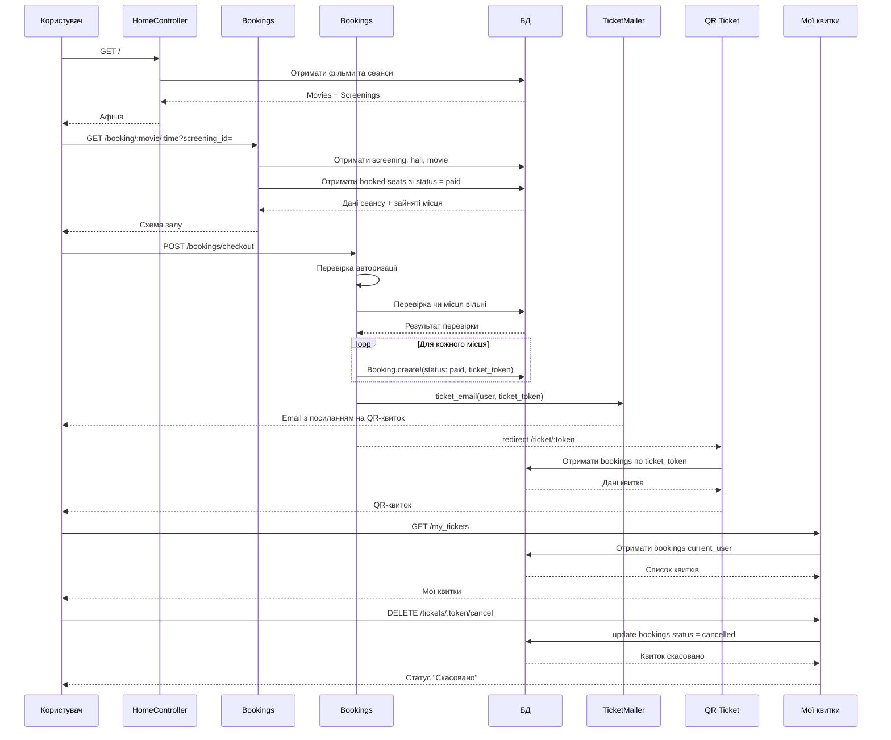

# Потік бронювання квитка (CinemaIF)

Цей документ описує, як користувач проходить шлях від афіші на головній сторінці до покупки квитка, QR-квитка, перегляду «Мої квитки» та скасування замовлення.

## Огляд

1. Користувач заходить на головну сторінку.
2. `HomeController` показує фільми та сеанси з БД.
3. Користувач вибирає сеанс.
4. Відкривається `BookingsController#show`.
5. Система показує зал і місця.
6. Зайняті місця беруться тільки з `Booking` зі `status: "paid"`.
7. Користувач вибирає місця.
8. Натискає checkout.
9. `BookingsController#checkout` перевіряє авторизацію.
10. Система перевіряє, чи місця ще не зайняті.
11. Для кожного вибраного місця створюється `Booking`.
12. Усі `Booking` одного замовлення мають один `ticket_token`.
13. Після покупки надсилається email через `TicketMailer`.
14. Користувача перекидає на QR-квиток.
15. У «Мої квитки» користувач бачить свої квитки.
16. Користувач може скасувати квиток.
17. При скасуванні `status` змінюється на `"cancelled"`.
18. Скасовані місця знову стають доступними.

## Діаграма послідовності



## Ключові маршрути

| Крок | HTTP | Шлях | Контролер / дія |
|------|------|------|-----------------|
| Афіша | GET | `/` (з locale) | `home#index` |
| Вибір місць | GET | `/booking/:movie/:time?screening_id=` | `bookings#show` |
| Оплата / checkout | POST | `/bookings/checkout` | `bookings#checkout` |
| QR-квиток | GET | `/ticket/:token` | `bookings#ticket` |
| Мої квитки | GET | `/my_tickets` | `bookings#my_tickets` |
| Скасування | DELETE | `/tickets/:token/cancel` | `bookings#cancel_ticket` |

## Важливі правила

1. **Зайняті місця** визначаються тільки по `status = "paid"`.
2. **Скасовані квитки** мають `status = "cancelled"`.
3. **Один `ticket_token`** об’єднує кілька місць в одне замовлення.
4. **Email** надсилається після успішного checkout.
5. **QR-квиток** відкривається через `ticket_token`.
6. **Користувач** бачить тільки свої квитки (у «Мої квитки» та при скасуванні — лише власні `Booking` з відповідним `ticket_token`).
7. **Адмін і модератор** керують фільмами, сеансами, анонсами та акціями через admin panel (`super_admin` додатково керує користувачами та ролями).

## Модель даних (спрощено)

```
User ──has_many──> Booking ──belongs_to──> Screening ──belongs_to──> Movie, Hall
```

- Окремої моделі `Ticket` немає: квиток = усі `Booking` з однаковим `ticket_token`.
- На одне місце — один рядок `Booking` (`row_number`, `seat_number`, `price`, `status`).

## Пов’язані файли в коді

| Компонент | Шлях |
|-----------|------|
| Афіша | `app/controllers/home_controller.rb` |
| Бронювання | `app/controllers/bookings_controller.rb` |
| Модель | `app/models/booking.rb` |
| Вибір місць | `app/views/bookings/show.html.erb` |
| QR-квиток | `app/views/bookings/ticket.html.erb` |
| Мої квитки | `app/views/bookings/my_tickets.html.erb` |
| Email | `app/mailers/ticket_mailer.rb` |
| Маршрути | `config/routes.rb` |
