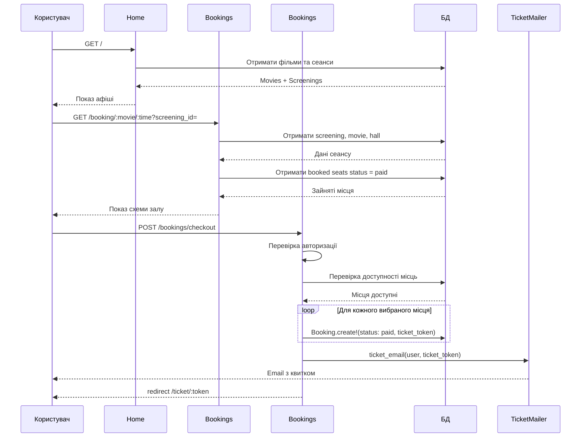

# Діаграма послідовності: бронювання квитка (CinemaIF)

Sequence diagram процесу покупки квитка — від головної сторінки до QR-квитка після checkout.

## Учасники

| Учасник | Опис |
|---------|------|
| **Користувач** | Відвідувач сайту |
| **Home** | `HomeController` — афіша |
| **Bookings#show** | Вибір місць у залі |
| **Bookings#checkout** | Оформлення замовлення |
| **БД** | SQLite / ActiveRecord |
| **TicketMailer** | Лист з посиланням на квиток |

## Діаграма послідовності

## Пояснення статусів і квитка

- **`status = paid`** — активний куплений квиток; таке місце вважається зайнятим на схемі залу.
- **`status = cancelled`** — скасований квиток; місце знову доступне для бронювання (у «Мої квитки» та при `Bookings#cancel_ticket`).
- **`ticket_token`** — один UUID на замовлення; об’єднує кілька `Booking` (місць) в одне замовлення / один QR-квиток.
- **Email** надсилається після успішного checkout через `TicketMailer#ticket_email`.
- **QR-квиток** відкривається за маршрутом `GET /ticket/:token` (дані з БД по `ticket_token`).

## Пов’язана документація

- [booking_flow.md](booking_flow.md) — повний потік з «Мої квитки» та скасуванням.
