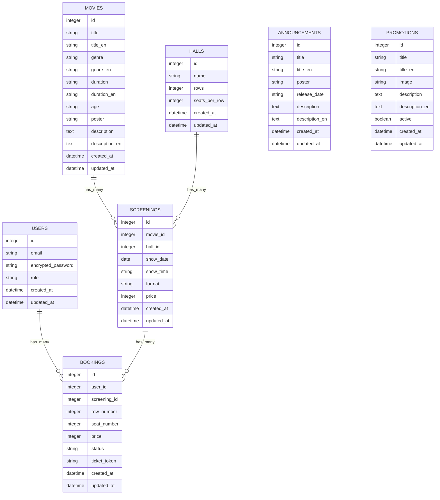

# Опис бази даних CinemaIF

## Вступ

База даних системи CinemaIF використовується для зберігання користувачів, фільмів, залів, сеансів, бронювань квитків, анонсів та акцій.

СУБД: **SQLite** (через Active Record). Зв’язки між основними сутностями бронювання реалізовані зовнішніми ключами (`foreign_key`). Таблиці `announcements` та `promotions` не пов’язані з іншими таблицями — вони обслуговують контент на головній сторінці.

---

## Опис таблиць

### `users`

**Призначення:** облікові записи користувачів (авторизація Devise, ролі доступу до адмін-панелі).

| Поле | Тип | Опис |
|------|-----|------|
| `id` | integer | Первинний ключ |
| `email` | string | Email для входу (унікальний) |
| `encrypted_password` | string | Захешований пароль (Devise) |
| `role` | string | Роль: `user`, `moderator`, `super_admin` (за замовчуванням `user`) |
| `remember_created_at` | datetime | Час «запам’ятати мене» (Devise) |
| `reset_password_token` | string | Токен скидання пароля (Devise) |
| `reset_password_sent_at` | datetime | Час відправки листа скидання пароля |
| `created_at`, `updated_at` | datetime | Час створення та оновлення запису |

**Зв’язки:**

- `has_many :bookings` — один користувач може мати багато бронювань (квитків).

---

### `movies`

**Призначення:** каталог фільмів з підтримкою української та англійської локалізації контенту.

| Поле | Тип | Опис |
|------|-----|------|
| `id` | integer | Первинний ключ |
| `title` | string | Назва фільму (українською) |
| `title_en` | string | Назва фільму (англійською) |
| `genre` | string | Жанр (українською) |
| `genre_en` | string | Жанр (англійською) |
| `duration` | string | Тривалість (українською), напр. «2 год 35 хв» |
| `duration_en` | string | Тривалість (англійською) |
| `age` | string | Вікове обмеження, напр. «12+», «16+» |
| `poster` | string | URL постера |
| `description` | text | Опис фільму (українською) |
| `description_en` | text | Опис фільму (англійською) |
| `created_at`, `updated_at` | datetime | Час створення та оновлення |

**Зв’язки:**

- `has_many :screenings` — один фільм може мати багато сеансів у різних залах і датах.

---

### `halls`

**Призначення:** кінозали з параметрами сітки місць для відображення схеми залу при бронюванні.

| Поле | Тип | Опис |
|------|-----|------|
| `id` | integer | Первинний ключ |
| `name` | string | Назва залу, напр. «Зал 1», «LUX 1» |
| `rows` | integer | Кількість рядів |
| `seats_per_row` | integer | Кількість місць у ряді |
| `hall_type` | string | Тип залу (напр. 2D, 3D, LUX) — додаткове поле в БД |
| `created_at`, `updated_at` | datetime | Час створення та оновлення |

**Зв’язки:**

- `has_many :screenings` (через `hall_id`) — у залі проходять різні сеанси.

---

### `screenings`

**Призначення:** конкретний показ фільму в залі на певну дату й час (сеанс для афіші та бронювання).

| Поле | Тип | Опис |
|------|-----|------|
| `id` | integer | Первинний ключ |
| `movie_id` | integer | Зовнішній ключ на `movies` |
| `hall_id` | integer | Зовнішній ключ на `halls` |
| `show_date` | date | Дата показу |
| `show_time` | string | Час початку, формат `HH:MM` |
| `format` | string | Формат показу: 2D, 3D, LUX, IMAX тощо |
| `price` | integer | Ціна квитка за одне місце (грн) |
| `created_at`, `updated_at` | datetime | Час створення та оновлення |

**Зв’язки:**

- `belongs_to :movie` — сеанс належить одному фільму.
- `belongs_to :hall` — сеанс проходить в одному залі.
- `has_many :bookings` — на сеанс припадають бронювання місць.

---

### `bookings`

**Призначення:** бронювання одного місця на сеанс. Кілька записів з одним `ticket_token` утворюють одне замовлення (квиток на кілька місць).

| Поле | Тип | Опис |
|------|-----|------|
| `id` | integer | Первинний ключ |
| `user_id` | integer | Зовнішній ключ на `users` — хто купив |
| `screening_id` | integer | Зовнішній ключ на `screenings` — який сеанс |
| `row_number` | integer | Номер ряду в залі |
| `seat_number` | integer | Номер місця в ряді |
| `price` | integer | Ціна місця на момент покупки |
| `status` | string | Статус: `paid` (активний), `cancelled` (скасований) |
| `ticket_token` | string | UUID замовлення; об’єднує місця одного квитка |
| `created_at`, `updated_at` | datetime | Час створення та оновлення |

**Зв’язки:**

- `belongs_to :user` — бронювання належить користувачу.
- `belongs_to :screening` — бронювання прив’язане до сеансу.

**Логіка статусів:**

- На схемі залу зайняті лише місця з `status = "paid"`.
- Після скасування `status` стає `"cancelled"`, місце знову вільне.

---

### `announcements`

**Призначення:** анонси майбутніх прем’єр на головній сторінці (блок «Анонси»).

| Поле | Тип | Опис |
|------|-----|------|
| `id` | integer | Первинний ключ |
| `title` | string | Назва (українською) |
| `title_en` | string | Назва (англійською) |
| `poster` | string | URL постера |
| `release_date` | string | Текст дати виходу, напр. «з 21 травня 2026» |
| `description` | text | Опис (українською) |
| `description_en` | text | Опис (англійською) |
| `created_at`, `updated_at` | datetime | Час створення та оновлення |

**Зв’язки:** немає зовнішніх ключів на інші таблиці (окрема сутність контенту).

---

### `promotions`

**Призначення:** акції та спеціальні пропозиції на головній сторінці (блок «Акції»).

| Поле | Тип | Опис |
|------|-----|------|
| `id` | integer | Первинний ключ |
| `title` | string | Назва акції (українською) |
| `title_en` | string | Назва акції (англійською) |
| `image` | string | URL зображення |
| `description` | text | Опис (українською) |
| `description_en` | text | Опис (англійською) |
| `active` | boolean | Чи показувати на сайті (`true` за замовчуванням) |
| `created_at`, `updated_at` | datetime | Час створення та оновлення |

**Зв’язки:** немає зовнішніх ключів на інші таблиці.

---

## ERD-діаграма (Mermaid)

---

## Зовнішні ключі (підсумок)

| Таблиця | Поле | Посилання |
|---------|------|-----------|
| `bookings` | `user_id` | `users.id` |
| `bookings` | `screening_id` | `screenings.id` |
| `screenings` | `movie_id` | `movies.id` |
| `screenings` | `hall_id` | `halls.id` |

---

## Пов’язані файли

- `db/schema.rb` — актуальна схема БД
- `app/models/` — моделі Active Record
